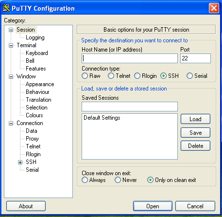

#Laboratory 1. Setup Environment
Pre-requisities: You only need SSH Access to Internet, The instructor provide of file with a private SSH Key.
Copy file called **oowbr-private.key** on your local directory.

## 1.1 Accessing to Your Enviroment
**On Windows:** You need to use some SSH Client like PuttySSH [download PuTTY](http://www.chiark.greenend.org.uk/~sgtatham/putty/download.html)

You can check how to configure private key on PuTTY [here](https://support.suso.com/supki/SSH_Tutorial_for_Windows)

In this screen you have to configure an private key:


So you put an HOST that instructor given to you.



**On Linux or Mac:** You need to use command line terminal typing "terminal" in search panel.

```
# ssh -i oowbr-private.key opc@p1.renecloud.io
```
## 1.3 Checking tools
Check that linux kernel is 4.1.x 
```
# uname -a
Linux oowbr4 4.1.12-37.5.1.el6uek.x86_64 #2 SMP Thu Jun 9 15:56:37 PDT 2016 x86_64 x86_64 x86_64 GNU/Linux
```
Check docker installation
```
# sudo docker --version
Docker version 1.10.3, build 57bf6fd

# sudo docker run hello-world
...
Hello from Docker.
```
Check Memory available
```
# sudo free -h
TODO: Put memory free example
```

## 1.4 Setting Up Admin Server
List all images on our local repository
```
# sudo docker images
REPOSITORY           TAG                 IMAGE ID            CREATED             SIZE
hello-world          latest              693bce725149        2 weeks ago         967 B
renecloud/weblogic   latest              8ad042d7793e        5 months ago        1.383 GB
```
List all our containers that are running
```
# sudo docker ps
CONTAINER ID    IMAGE       COMMAND         CREATED         STATUS          PORTS             NAMES
```
In fact there aren't instances yet

Run container **wlsadmin** Weblogic Admin Server
```
# sudo docker run --name wlsadmin -d -p 8001:8001 renecloud/weblogic
dd35826b21fa4e6e96bb66c2c7196c602c1d8862c3148562e29de6b78f573e35
```
This container is running up, Now we will check logs. Firstable we need to get CONTAINER ID
```
# sudo docker ps
CONTAINER ID        IMAGE                COMMAND              CREATED             STATUS              PORTS                                        NAMES
dd35826b21fa        renecloud/weblogic   "startWebLogic.sh"   6 seconds ago       Up 5 seconds        5556/tcp, 7001/tcp, 0.0.0.0:8001->8001/tcp   wlsadmin
```
Now we can see all logs of this instance
```
# sudo docker logs --tail=all dd35826b21fa  <---- Change for your CONTAINER ID
<Jun 28, 2016 1:18:13 AM UTC> <Notice> <WebLogicServer> <BEA-000360> <The server started in RUNNING mode.> 
<Jun 28, 2016 1:18:13 AM UTC> <Notice> <WebLogicServer> <BEA-000365> <Server state changed to RUNNING.> 
```
Your Weblogic Admin is ready!
Please verify on your Web Browser 

http://<ID>.renecloud.io:8001/console

TODO: Put weblogic_welcome.png

## 1.5 Setting Up Managed Servers
So, then go next to put two Managed Weblogic
```
# sudo docker run --name m1 -d -p 7101:7001 --link wlsadmin:wlsadmin renecloud/weblogic createServer.sh
607f1889829b236efff6739a11397655b516ac5af185667a0a5b2d5e0b67631b

# sudo docker logs --tail=all dd35826b21fa  <---- Change for your CONTAINER ID
Server with name ManagedServer-SHc0xS@607f1889829b started successfully
```
and the same for second Managed Weblogic chaning name to **m2** and mapping port **7102:7001" 
```
# sudo docker run --name m2 -d -p 7102:7001 --link wlsadmin:wlsadmin renecloud/weblogic createServer.sh
607f1889829b236efff6739a11397655b516ac5af185667a0a5b2d5e0b67631b

# sudo docker logs --tail=all dd35826b21fa  <---- Change for your CONTAINER ID
Server with name ManagedServer-SHc0xS@607f1889829b started successfully
```
Please check on Weblogic Administration Console, Environment-->Servers. You will see admin and managed server RUNNING

TODO: Put Webconsole2.png image

## 1.4 Setting Up Coherence Cluster
Using the same Docker Image we will create an manchines in order to create our Coherence Managed Server and Cluster
Then, creating Weblogic Machines
```
# sudo docker run --name c1 -d -p 7201:7001 -p 7501:7574 --link wlsadmin:wlsadmin renecloud/weblogic createMachine.sh
607f1889829b236efff6739a11397655b516ac5af185667a0a5b2d5e0b67631a

# sudo docker logs --tail=all dd35826b21fa  <---- Change for your CONTAINER ID
Activating all your changes, this may take a while ... 
The edit lock associated with this edit session is released once the activation is completed.
```
Same for the other Weblogic Machine, but change name to **c2** mapping ports **7202:7001** and **7502:7574**
```
# sudo docker run --name c2 -d -p 7202:7001 -p 7502:7574 --link wlsadmin:wlsadmin renecloud/weblogic createMachine.sh
607f1889829b236efff6739a11397655b516ac5af185667a0a5b2d5e0bad631a

# sudo docker logs --tail=all dd35826b21fa  <---- Change for your CONTAINER ID
Activating all your changes, this may take a while ... 
The edit lock associated with this edit session is released once the activation is completed.
```
Yo can verify all Docker Instances are running on our host and free memory available
```
# sudo docker ps
CONTAINER ID        IMAGE                COMMAND              CREATED             STATUS              PORTS                                                                NAMES
71ac37c7132a        renecloud/weblogic   "createMachine.sh"   2 minutes ago       Up 2 minutes        5556/tcp, 8001/tcp, 0.0.0.0:7202->7001/tcp, 0.0.0.0:7502->7574/tcp   c2
ac41a0690c3a        renecloud/weblogic   "createMachine.sh"   8 minutes ago       Up 8 minutes        5556/tcp, 8001/tcp, 0.0.0.0:7201->7001/tcp, 0.0.0.0:7501->7574/tcp   c1
59b6d4448611        renecloud/weblogic   "createServer.sh"    35 minutes ago      Up 35 minutes       5556/tcp, 8001/tcp, 0.0.0.0:7102->7001/tcp                           m2
607f1889829b        renecloud/weblogic   "createServer.sh"    45 minutes ago      Up 45 minutes       5556/tcp, 8001/tcp, 0.0.0.0:7101->7001/tcp                           m1
dd35826b21fa        renecloud/weblogic   "startWebLogic.sh"   About an hour ago   Up About an hour    5556/tcp, 0.0.0.0:8001->8001/tcp, 7001/tcp                           wlsadmin

# sudo free -h
             total       used       free     shared    buffers     cached
Mem:           14G       9.7G       5.0G       196K       464M       2.6G
-/+ buffers/cache:       6.7G       8.0G
Swap:         287M         0B       287M
```
Please check again your Weblogic Console Administrator:

TODO 


