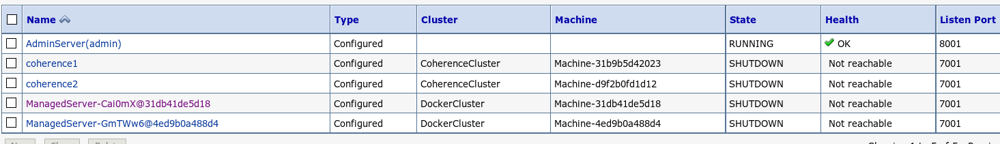
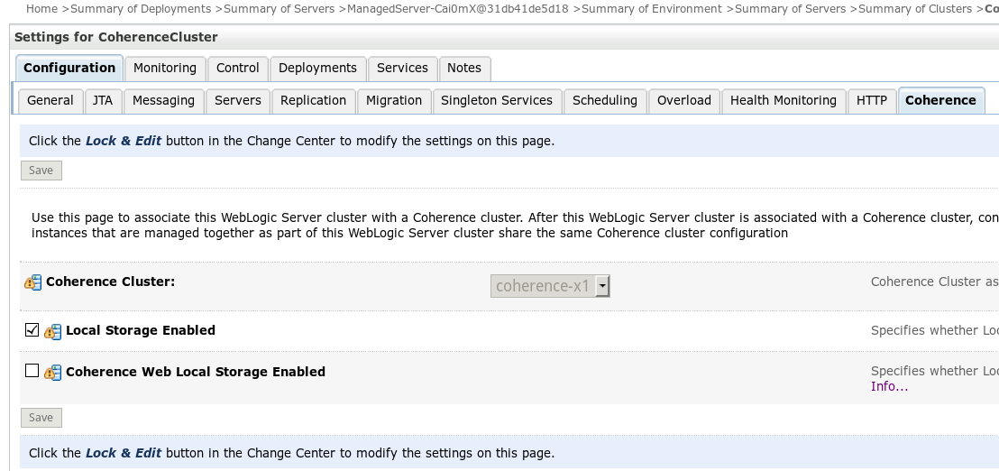
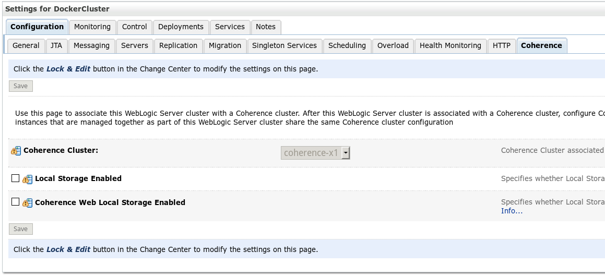

#Laboratory 2. Deploy Application

## 2.1 Checking Clusters configuration
Check that all servers are on Shutdown 

Now verify that Coherence Cluster has an **Local Storage Enabled** 

For Docker Cluster not checked is necessary

So, we have to start all servers 

## 2.2 Deploy Grid Application for coherence

Download two files this [one](https://github.com/renecloud/HOL-OOWBR/raw/master/files/ExampleGAR.gar) for Coherence Application and other [one](https://github.com/renecloud/HOL-OOWBR/raw/master/files/ExampleEAR.ear) for Web Application  

In the Domain Structure pane navigate to Environment > Deployments.
In the Summary of Installments pane click Install.

Select ExampleGAR.gar and click Next.
On the Choose Targetting style step ensure that Install this deployment as an application is checked and click Next.
In the Select deployment targets step choose **CoherencecCluster** > All Servers in the Cluster. 

And click Next.
In the Optional Settings step click Finish. The Summary of Deployments pane will be displayed and should resemble: 

So, then install, and start the application

Select the file ExampleEAR.ear. The Install Application Assistant pane should resemble:

On the Choose Targeting style step ensure that Install this deployment as an application is checked and click Next.
In the Select Deployment Targets step, ensure that **DockerCluster** is checked and click Next.

Expand ExampleEAR by clicking the plus (+) sign. The application will expand and should resemble that shown below.

Run the application by entering URL http://localhost:port/example-web-app/faces/ContactList.jsp where port is either 7201 or 7202.

The application should display a page similar to:

**Great!! finishied Lab two**

