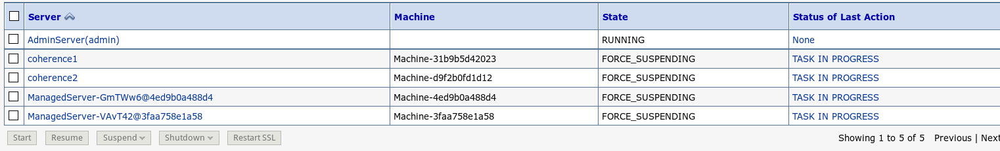
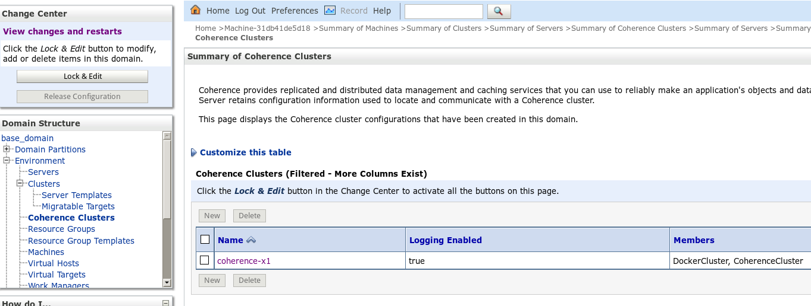
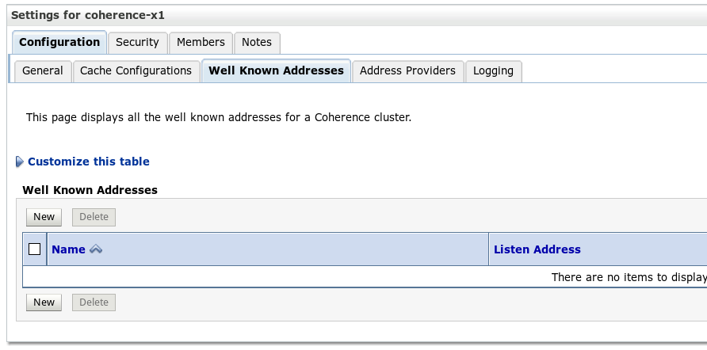

# Laboratory 4. Configure Federating Caching

## 4.1 Preparing configuration file

We have define configuration file in order to mapping two clusters 

With your pair team define those configuration files. [here](https://github.com/renecloud/HOL-OOWBR/raw/master/files/coh-config-fed.xml) is an exmaple.
The idea is to put internal IP's and ports where clusters are listening. 

```
<federation-config>
 
  <participants>
   
   <participant>
    <name>coherence-x6</name>
    <remote-addresses>
     <socket-address>
      <address>172.17.0.3</address>
      <port>7475</port>
     </socket-address>
    </remote-addresses>
   </participant>
  
   <participant>
    <name>coherence-x1</name>
    <remote-addresses>
     <socket-address>
      <address>10.196.134.86</address>
      <port>7501</port>
     </socket-address>
    </remote-addresses>
   </participant>
```
## 4.2. Uploading configuration file to docker container.

Once you define both files one for each cluster. 

On Windows. You could use PSCP from Putty download page [here](http://www.chiark.greenend.org.uk/~sgtatham/putty/download.html)

On Linux / MacOS copy that from our Laptop to Oracle Public Cloud files with follow command:

```
# scp -i oowbr.private.key coh-config-fed.xml opc@z3.renecloud.io:/home/opc
```
Back to our console we have to put inside the Docker Container.

Check container name and copy each file 
```
# sudo docker ps
# sudo docker cp coh-config-fed.xml wlsadmin:/u01/oracle
```

## 4.3 Re-configure Coherence Cluster

We have to stop all servers of both domains. 


Go to Environment--> Coherence Cluster and select current cluster



Checked ** Use a Custom Cluster Configuration File ** and type path to our configuration file that previously uploaded.


and press button Save.

Go to next tab ** Well Known Addresses ** and then press "New" button.



Put same information as you configure in your configuration file.


Active all yor changes. 

Restart all your servers and Enjoy!!


